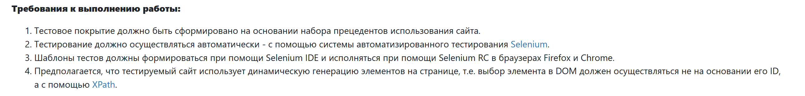
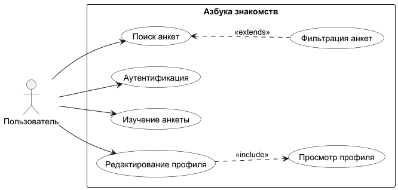

# Лабораторная работа №3
**ФИО**: Рахимов Ильнар Ильдарович
**Группа**: P3319  
**Преподаватель**: Тюрин И.Н.  
**Вариант**: azbyka.ru/znakomstva
## Условие

## Ход работы
### Use Case диаграмма

### Перечень тестовых сценариев
- Авторизация: корректные/некорректные креды, сообщения об ошибках, переход в профиль и выход.
- Поиск пользователей: выбор фильтров (пол, страна, регион, город, возраст, рост), запуск поиска, проверка количества и карточек.
- Просмотр профиля: открытие профиля по ID, чтение полей (страна, город, возраст), переключение вкладок.
- Редактирование профиля: изменение полей и ожидание успешного сохранения.
### Checklist тестового покрытия
| ID | Проверка | Статус |
| --- | --- | --- |
| AUTH-001 | Успешная авторизация при правильных логине и пароле — после ввода логина и пароля открывается профиль | Покрыто |
| AUTH-002 | Невалидный логин (не email) — авторизация не происходит, показывается сообщение "Введите емейл или телефон" | Покрыто |
| AUTH-003 | Неверный логин (email не найден) — авторизация не происходит, показывается сообщение "Пользователь с таким емейлом не найден" | Покрыто |
| AUTH-004 | Неверный пароль для корректного email — показывается сообщение об ошибке, содержащее текст о неверном пароле | Покрыто |
| AUTH-005 | Авторизация + выход (logout) — после входа пользователь выходит и возвращается на домашнюю страницу | Покрыто |
| SEARCH-001 | Поиск анкет по полу и стране — выводится список карточек; проверка country и gender в профиле | Покрыто |
| SEARCH-002 | Поиск анкет по региону и городу (например, Санкт-Петербург) — результаты из выбранного города | Покрыто |
| SEARCH-003 | Поиск анкет по возрастному диапазону (18–25) — все результаты в заданном диапазоне | Покрыто |
| SEARCH-004 | Поиск анкет по диапазону роста (160–180 см) — результаты соответствуют интервалу роста | Покрыто |
| SEARCH-005 | Сложный поиск с набором фильтров (country, region, city, age, height) — результаты полностью соответствуют всем критериям | Покрыто |
| ANKETA-001 | Открытие анкеты пользователя по ID — URL содержит "/prosmotr-ankety/{id}" | Покрыто |
| ANKETA-002 | Проверка отображаемых данных в анкете (например, дата рождения содержит ожидаемую строку) | Покрыто |
| PROF-001 | Открытие страницы профиля (после авторизации) — проверка, что URL содержит "/profil" | Покрыто |
| PROF-002 | Открытие страницы редактирования профиля — доступ к форме редактирования | Покрыто |
| PROF-003 | Редактирование поля "имя в крещении" и успешное сохранение — значение изменяется и сохраняется | Покрыто |
### Результаты тестирования
Тестовый прогон выполнять через:
```bash
gradle test -DbaseUrl="https://azbyka.ru/znakomstva/" -DbrowserName=chrome -Dheadless=false
```
Итоговые результаты:
* Всего тестов: 15
* Успешно: 15
* Неудачно: 0
* Пропущено: 0
## Вывод
В рамках лабораторной работы был проведен комплексный анализ и тестирование функционала сайта знакомств azbyka.ru/znakomstva. Были разработаны тестовые сценарии, охватывающие ключевые функции: авторизацию, поиск пользователей, просмотр и редактирование профиля. Все тесты были успешно выполнены, что подтверждает корректную работу основных функций сайта. Использование чек-листа обеспечило систематическое покрытие всех критических аспектов пользовательского взаимодействия, а результаты тестирования подтвердили стабильность и надежность приложения.

