# Лабораторная работа №4
**ФИО**: Рахимов Ильнар Ильдарович  
**Группа**: P3319  
**Преподаватель**: Тюрин И. Н.  

## Задание
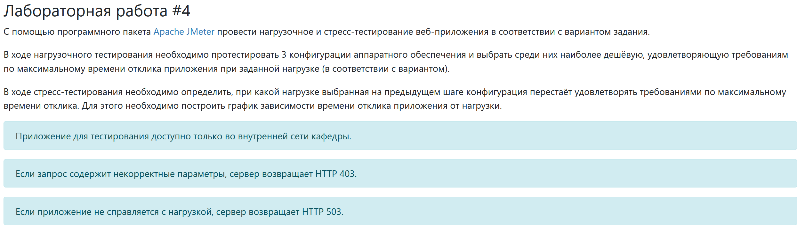
Параметры тестируемого веб-приложения:
* URL первой конфигурации ($ 1700) - ```http://stload.se.ifmo.ru:8080?token=518502792&user=-1355041423&config=1```
* URL второй конфигурации ($ 3200) - ```http://stload.se.ifmo.ru:8080?token=518502792&user=-1355041423&config=2```
* URL третьей конфигурации ($ 4300) - ```http://stload.se.ifmo.ru:8080?token=518502792&user=-1355041423&config=3```
* Максимальное количество параллельных пользователей - 6
* Средняя нагрузка, формируемая одним пользователем - 20 rpm
* Максимально допустимое время обработки запроса - 460 ms

## Описание конфигурации JMeter для нагрузочного тестирования
### Общее описание
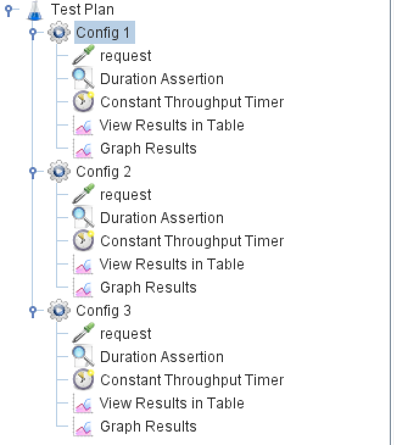
### Конфигурация Thread Group
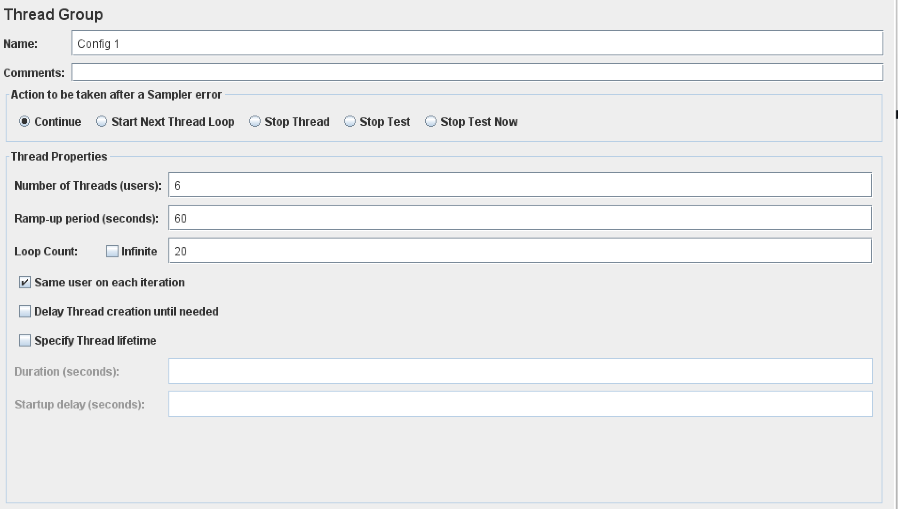
### Конфигурация HTTP Request
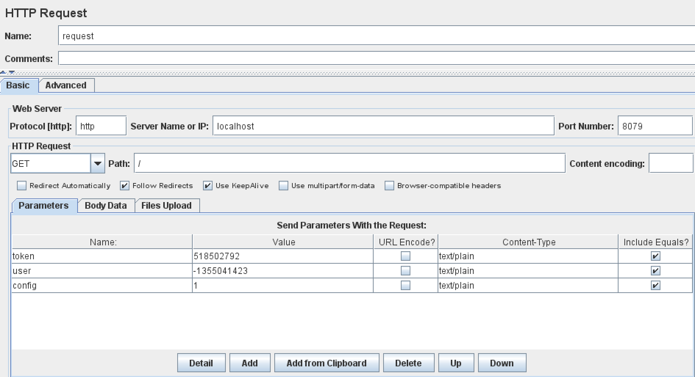
### Конфигурация Duration Assertion
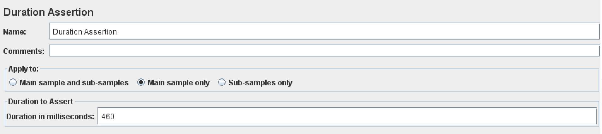
### Конфигурация Constant Throughput Timer
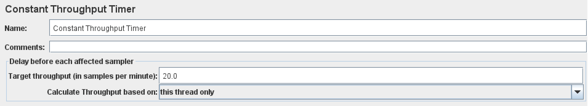

## Графики пропускной способности приложения, полученные в ходе нагрузочного тестирования.
### График времени ответа в зависимости от продолжительности
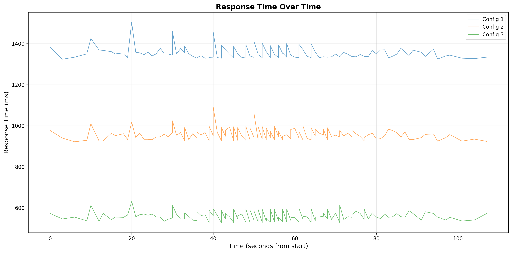
### Диаграмма времени ответа
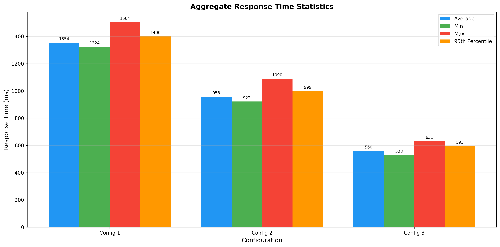
### Все метрики времени ответа
| Configuration | Average | Median  | 75th %  | 90th %  | 95th %  | 99th %  | Min     | Max     | Count |
|---------------|---------|---------|---------|---------|---------|---------|---------|---------|-------|
| Config 1      | 1354.44 | 1348.00 | 1362.25 | 1390.20 | 1400.10 | 1458.24 | 1324.00 | 1504.00 | 120   |
| Config 2      | 958.22  | 952.00  | 974.50  | 993.20  | 999.00  | 1053.16 | 922.00  | 1090.00 | 120   |
| Config 3      | 560.40  | 556.00  | 573.00  | 593.00  | 595.00  | 613.62  | 528.00  | 631.00  | 120   |

## Выводы по выбранной конфигурации аппаратного обеспечения
По итогам нагрузочного тестирования видно, что ни одна конфигурация 
не соответствует заданным требования:
1. Максимум - 1504 мс; В среднем - 1354 мс; Минимум - 1324 мс
2. Максимум - 1090 мс; В среднем - 958 мс; Минимум - 922 мс
3. Максимум - 631 мс; В среднем - 560 мс; Минимум - 528 мс

Из этого цирка 3 конфигурация хоть и является самой дорогой, зато превышает 
требования по максимальному времени ответа всего на треть. Выберем ее.

## Описание конфигурации JMeter для стресс-тестирования
По нагрузочному тестированию мы знаем, что уже при 6 юзерах с 20 rpm
сервер не справляется с нагрузкой. Поэтому нагрузочное тестирование
сделаем так, чтобы оно постепенно наращивала количество пользователей
с 20 rpm, пока не будут вылетать 503 ошибки. Так мы поймем когда сервер 
уже не сможет отвечать 
### Общее описание
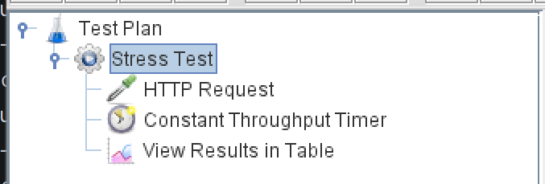
### Конфигурация Thread Group
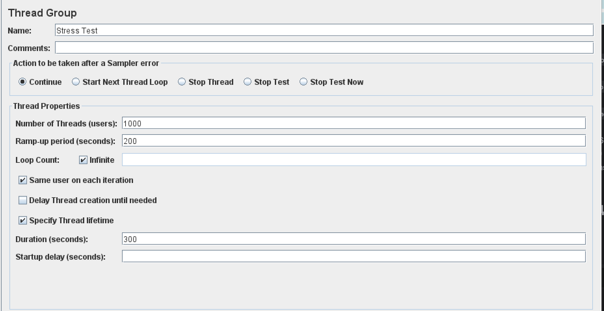
### Конфигурация HTTP Request

### Конфигурация Constant Throughput Timer
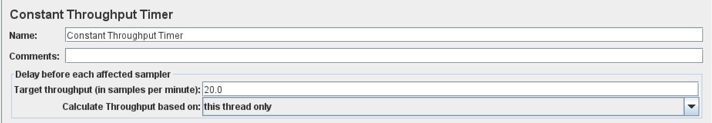

## График изменения времени отклика от нагрузки для выбранной конфигурации, полученный в ходе стресс-тестирования системы.
### График отклика
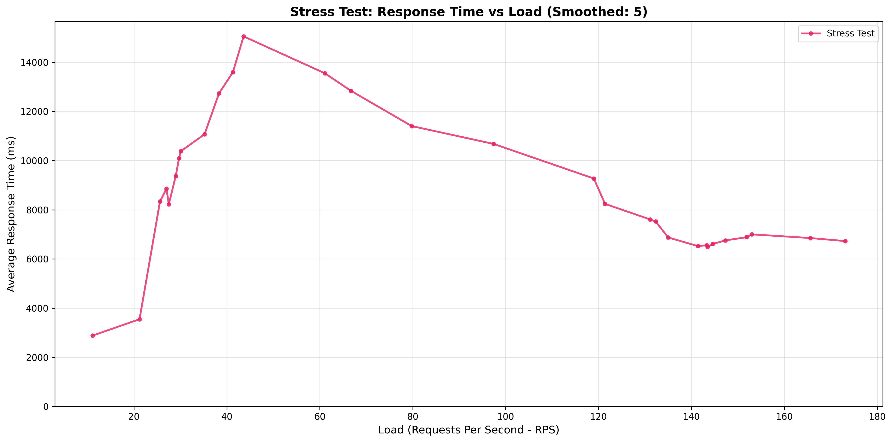
### Все метрики времени ответа
| Configuration | Average | Median | 75th % | 90th % | 95th % | 99th % | Min | Max | Std Dev | Count |
|---------------|---------|--------|--------|--------|--------|--------|-----|-----|---------|-------|
| Stress Test | 7763.55 | 4078.00 | 7256.00 | 12775.00 | 33659.00 | 42617.00 | 1887.00 | 52025.00 | 8840.98 | 26672 |
### Выводы по стресс тестированию
По графику видно, что после ~45 (около 135 пользователей при 20 rpm) 
пошли 503 ошибки. После чего сервер начал снижать нагрузку, выдавая 
ошибки

## Вывод
В ходе лабораторной работы было проведено нагрузочное и стресс 
тестирования сервера. В ходе нагрузочного тестирования была выбрана
3 конфигурация, которая хоть и не удовлетворяет требованиям, но
больше всего под них подходит. В ходе стресс тестирования было 
определено после какой нагрузки сервер начинает отдавать 503 ошибки
