# Лабораторная работа №2

**ФИО**: Рахимов Ильнар Ильдарович
**Группа**: P3319  
**Преподаватель**: Тюрин И.Н.  
**Вариант**: 3900
## Условие
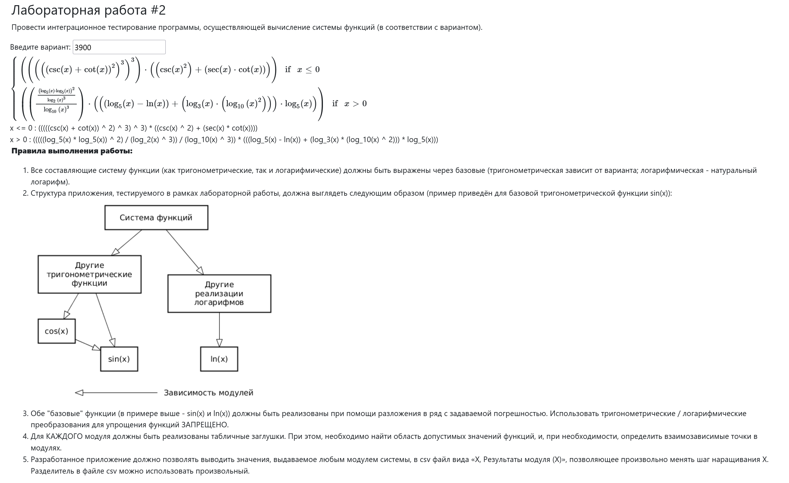
## Ход работы
### Анализ функции
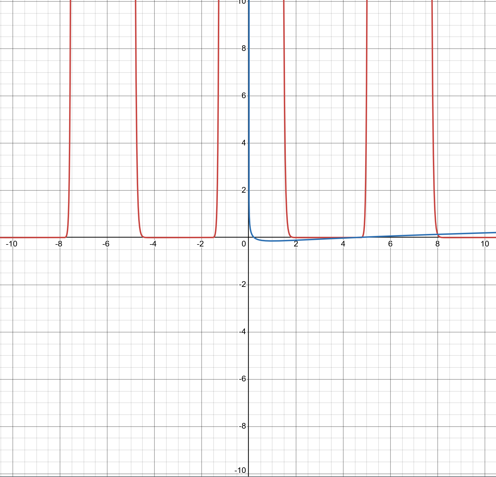
Область определения: $D ( f ) = ( − ∞ , 0 ] ∖ k π 2   ∪   ( 0 , ∞ ) ∖ 1 ,   k ∈ Z .$

Область значений: $\mathbb{R}$

## Выполнение
### UML диаграмма классов
Архитектура построена по модульному принципу. 
Реализованы базовые функции: $sin, ln$. С помощью них через композицию реализованы остальные математические функции.
Это позволяет использывать заглушки (stub) для тестирования
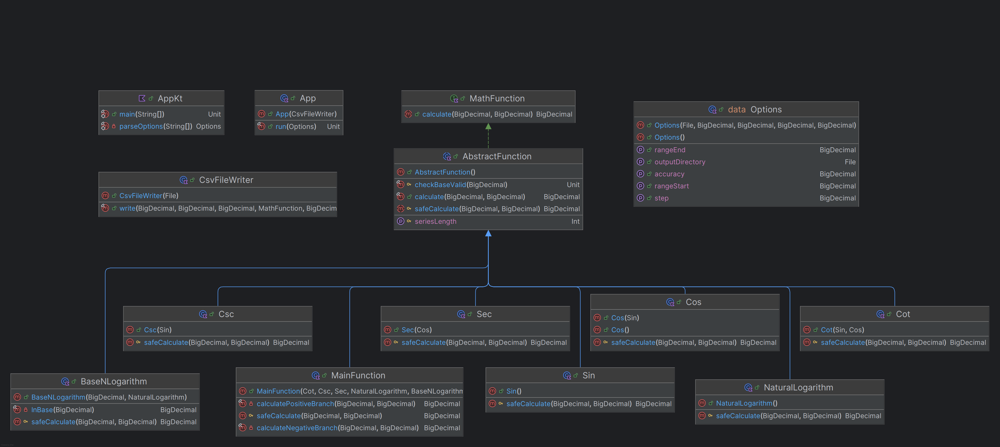
### Тестовое покрытие и стратегия интегрирования
Для проверки интеграции модулей приложения была выбрана восходящая стратегия интеграции (Bottom-Up)

Причины:
1. Вычисление функций базируется на результатах двух базовых функций ($sin, ln$)
2. Восходящая интеграция позволяет подменять малую часть системы, что положительно сказывается на надежности проверки работы
3. Подмена заглушками является базовым функционалом и реализуется библиотеками, например `Mockito`

Для проверки работоспособности модулей использовались модульные тесты через библиотеку `Cotest`

При разработке тестов применялись следующие методики:
- *Анализ классов эквивалентности:* Входные данные были разбиты на интервалы, в которых поведение функции не меняется. Из каждого интервала проверялось табличное значение на корректность
- *Анализ граничных значений:* Из входных данных были выделены точки, в которых поведение программы могло сломаться из за особенности реализации счисления в компьютере и особенностей математических функций
- *Параметризованные тесты:* Использовались параметризованные тесты для проверки большого количества точек

### Графики результатов интеграции
#### Секант
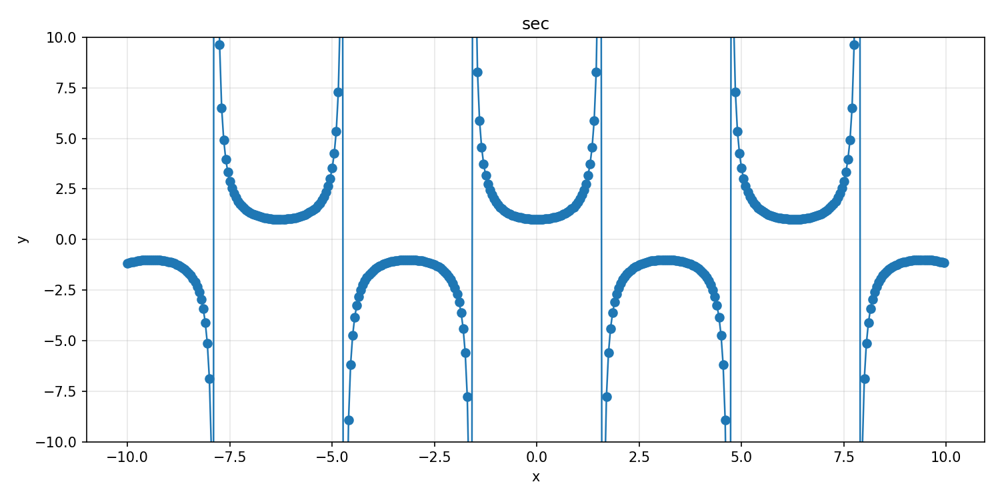
#### Косекант
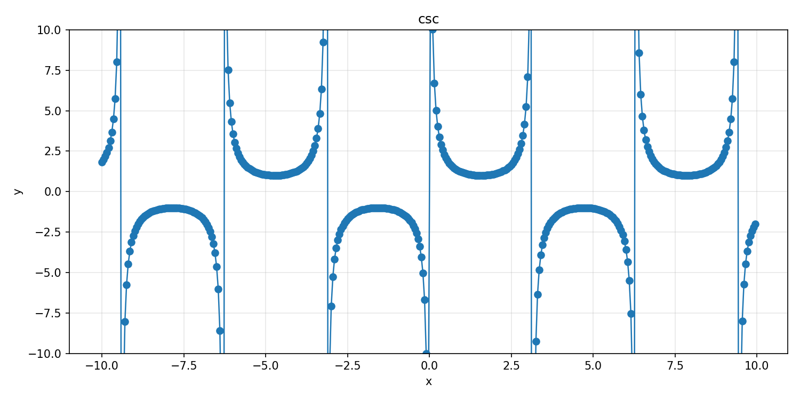
#### Котангенс
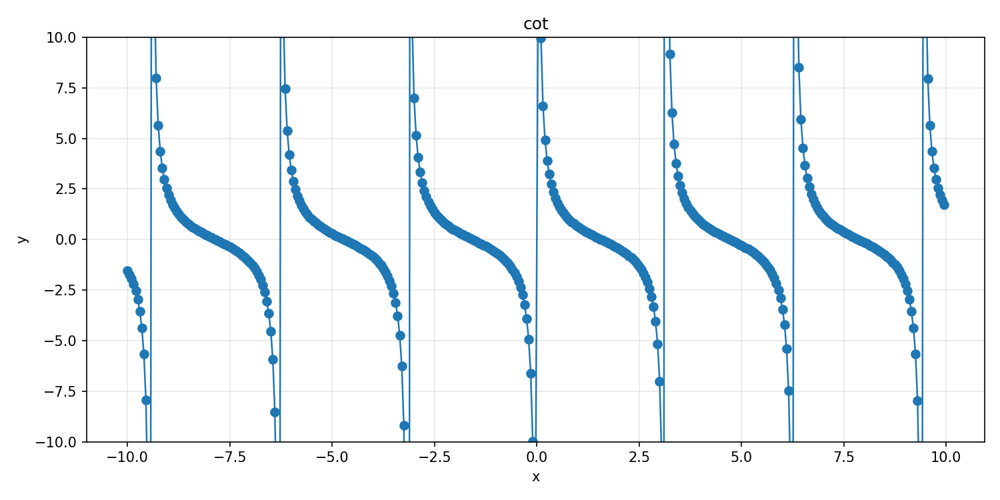
#### Натуральный логарифм
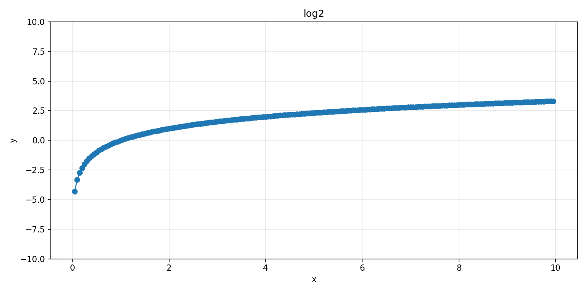
#### Логарифм по основанию 3
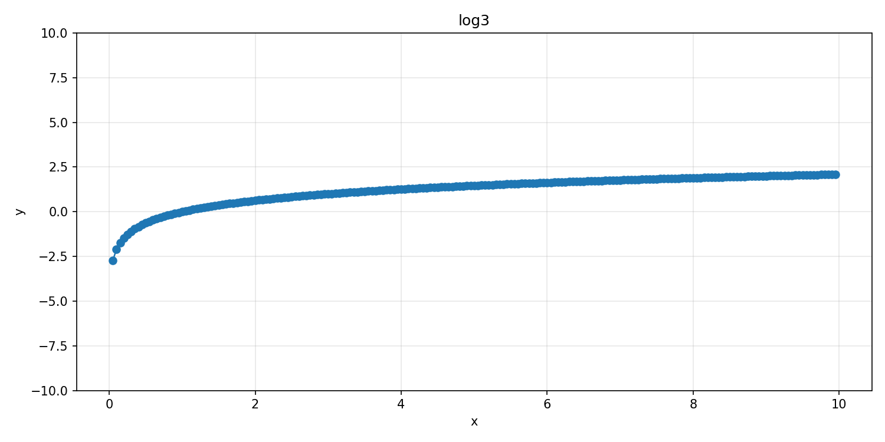
#### Логарифм по основанию 5
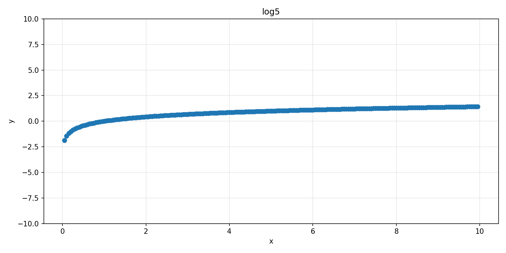
#### Логарифм по основанию 10
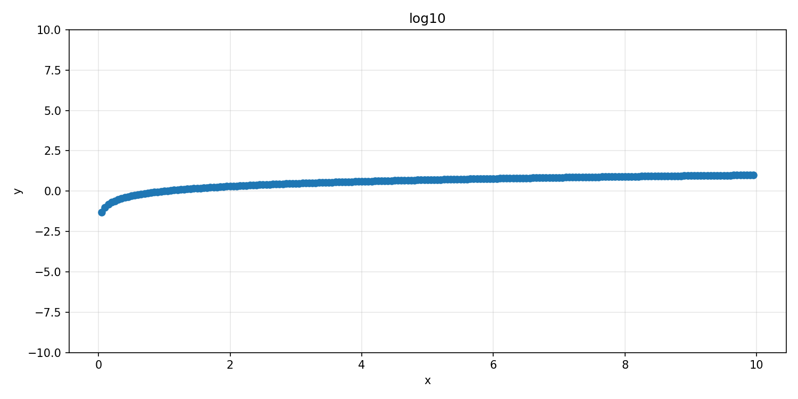
#### Основная функция
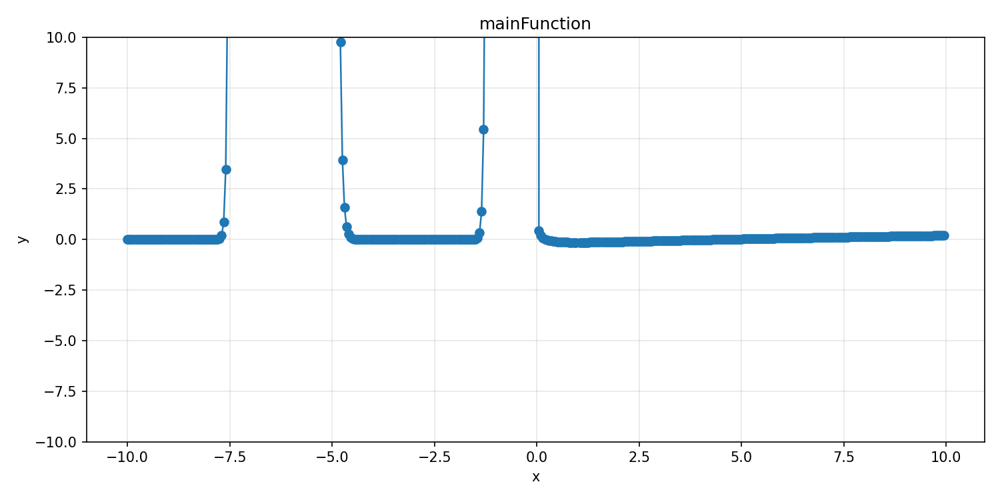
На графике видно, что реализация на основе рядов Тейлора с заданной погрешностью корректно аппроксимирует функцию на заданных интервалах, за исключением областей, непосредственно прилегающих к точкам разрыва (асимптотам).

## Вывод
В рамках лабораторной работы было создано приложение, предназначенное для вычисления набора функций на основе разложений в ряды Тейлора.

Использование восходящего подхода к интеграционному тестированию в сочетании с mock‑объектами позволило выявлять и изолировать дефекты уже на ранних этапах объединения модулей. Применение разбиения на классы эквивалентности и анализа граничных случаев обеспечило хорошее покрытие ключевой логики, включая корректную проверку и обработку областей допустимых/недопустимых значений (ОДЗ). Экспорт результатов в формат CSV и последующая визуализация в виде графиков подтвердили согласованность работы собранной системы и точность вычислений в пределах заданной погрешности.