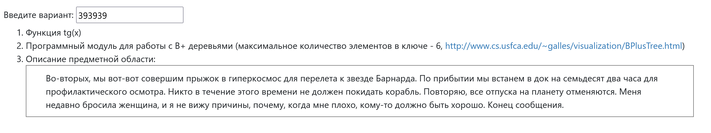
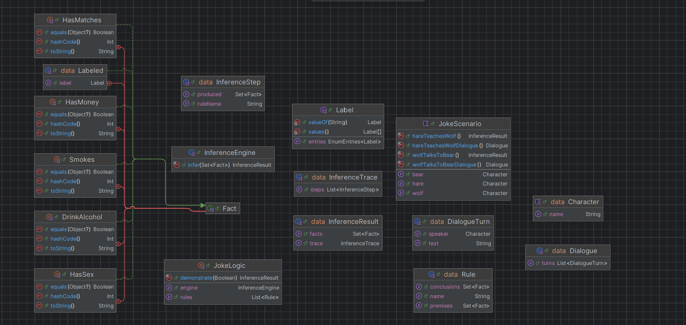

# Лабораторная работа №1
**Выполнил**: Рахимов И.И. (409442)  
**Группа**: P3319  
**Преподаватель**: Тюрин И.Н.  
**Вариант**: 393939
***
## Условие

## Задание 1
### Описание

Необходимо реализовать разложение в степенной ряд функции $\tan(x)$  
и провести модульное тестирование с достаточным тестовым покрытием (**100% coverage**)

Область определения функции:

$$
x \in \mathbb{R},\quad x \ne \frac{\pi}{2} + k\pi,\quad k\in\mathbb{Z}
$$

## Реализация

Используется разложение функции $\tan(x)$ в ряд в окрестности нуля:

$$
\tan(x) = \sum_{k=1}^{n} c_k x^{2k-1}
$$

где $c_k$ — коэффициенты разложения, задаваемые рекуррентно:

$$
c_k = \frac{1}{2k-1} \sum_{j=1}^{k-1} c_j\,c_{k-j}, \quad k \ge 2,\qquad c_1=1
$$

Так как такое разложение корректно работает только в окрестности $0$, аргумент предварительно преобразуется:

1. Приводим аргумент к интервалу $[-\pi/2,\ \pi/2]$
2. Если $|x| > \pi/16$, делим $x$ на 2 и повторяем шаг 2 (пока не попадём в окрестность 0)
3. Восстанавливаем значение функции по формуле удвоения:

$$
\tan(2x) = \frac{2\tan(x)}{1 - \tan^2(x)}
$$

### Тестирование

Выделил следующие категории тестов:

1. **Data-driven тесты табличных значений**
2. **Особенности поведения чисел с плавающей точкой**
    - корректность вычисления у двух немного разных, но больших X
    - экстремальные значения
    - корректность знака
3. **Математические свойства**
    - Периодичность
    - Нечётность
    - Близость к аргументу при малых значениях

## Задание 2

### Описание
Необходимо реализовать алгоритм B+ дерево 
и провести тестирование с достаточным тестовым покрытием (**100% coverage**).
Для этого выбрать характерные точки внутри алгоритма и сравнить попадания с эталонными

### Характерные точки
Покроем все методы ветви программы точками трейсом. 
Будем выводить операцию (название метода), стадию, ключ (если есть) и какую нибудь детализацию
Получилось:
1. Get
    - start
    - miss
    - hit
2. Insert
    - start
    - update
    - placed
    - split_leaf_required
3. Delete
    - start
    - not_found
    - removed
    - root_leaf_done
    - no_rebalance_needed
    - rebalance_leaf_required
4. Split_leaf
    - start
    - done
5. Split_branch
    - start
    - done
6. Insert_parent
    - new_root
    - insert_child
    - split_branch_required
7. Rebalance_leaf
    - borrow_left
    - borrow_right
    - merge_into_left
    - merge_right_into_leaf
8. Rebalance_branch
    - root_shrink
    - root_rebuild
    - enough_children
    - borrow_left
    - borrow_right
    - merge_into_left
    - merge_right_into_node
9. Refresh
    - branch_keys_rebuilt
10. Find_leaf
    - start
    - step
    - done

### Тестирование
Выделил следующие категории тестов:
1. **Black Box тесты методов API**
2. **Тесты на разном макс значение ключей в узле**
3. **Тесты на сравнение попадания в характерные точки**

## Задание 3
### Описание
Сформировать доменную модель заданного текста (можно хорошего анекдота).
Разработать тестовое покрытие для данной доменной области
### Анекдот
```text
Сидит заяц на полянке, книжку читает. Мимо проходит Волк и у Зайца спрашивает:
- Что за книгу читаем?
  Заяц:
- Логику
  Волк:
- А что это значит?
- Ну, смотри, я покажу на примере. Спички у тебя есть?
- Ну есть и что?
- Значит, ты куришь сигареты. Правильно?
- Курю.
- А если куришь, значит и бухаешь?
- Ну да, выпиваю иногда.
- Если бухаешь, то значит водятся деньги?
- Ага.
- Если есть бабло, значит ебёшь баб?
- Слушай, верно!!!
- Вывод: если ебёшь баб, то ты не пидарас!
- Слыш, заяц, а дай ка мне тоже почитать?
  Заяц дал Волку книгу и тот пошёл читать. Сидит, читает... Мимо проходит медведь. Медведь Волку:
- Что читаем?
- Логику
- А что это значит?
- Ну, покажу на примере. Спички у тебя есть?
- Неа...
- Хм... Тогда ты пидарас.
```
### Доменная модель
Сделаем модель, в которой будут персонажи, вопросы, факты диалог и вывод из него.
Все это реализует бизнес логику, которая будет проверяться тестами.
### UML диаграмма
